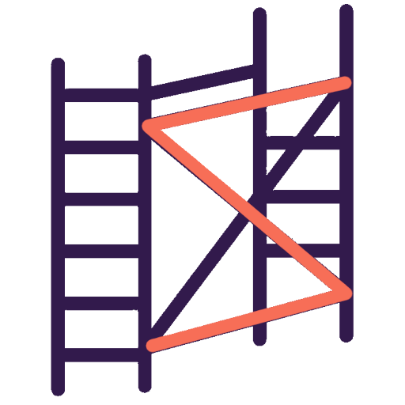

<div align="center">

  
  <h1 style="color: #F76E57">Scala Fullstack Scaffold</h1>
  
  <p>
    Build easily your REST API and ScalaJS Frontend with this scaffolding project !
  </p>
  
  
<!-- Badges -->
<p>
  <a href="https://github.com/do4-2022/scala-fullstack-scaffold.g8/graphs/contributors">
    
  </a>
  <a href="https://github.com/do4-2022/scala-fullstack-scaffold.g8/commits/main">
    
  </a>
  <a href="https://github.com/do4-2022/scala-fullstack-scaffold.g8/network/members">
    
  </a>
  <a href="https://github.com/Louis3797/do4-2022/scala-fullstack-scaffold.g8">
    
  </a>
  <a href="https://github.com/do4-2022/scala-fullstack-scaffold.g8/issues/">
    
  </a>
  <a href="https://github.com/do4-2022/scala-fullstack-scaffold.g8/blob/master/LICENSE">
    
  </a>
</p>
   
<h4>
    <a href="https://github.com/do4-2022/scala-fullstack-scaffold.g8">Documentation</a>
  <span> · </span>
    <a href="https://github.com/do4-2022/scala-fullstack-scaffold.g8/issues/">Report Bug</a>
  <span> · </span>
    <a href="https://github.com/do4-2022/scala-fullstack-scaffold.g8/issues/">Request Feature</a>
  </h4>
</div>

<br />

<!-- Table of Contents -->
# :notebook_with_decorative_cover: Table of Contents

- [:notebook\_with\_decorative\_cover: Table of Contents](#notebook_with_decorative_cover-table-of-contents)
  - [:star2: About the Project](#star2-about-the-project)
    - [:dart: Features](#dart-features)
  - [:toolbox: Getting Started](#toolbox-getting-started)
    - [:bangbang: Prerequisites](#bangbang-prerequisites)
    - [:running: Run Locally](#running-run-locally)
    - [:rocket: Build](#rocket-build)
  - [:wave: Contributing](#wave-contributing)
  - [:warning: License](#warning-license)
  - [:handshake: Authors](#handshake-authors)

<!-- About the Project -->
## :star2: About the Project

Scala Fullstack Scaffold is a projects aims to start quickly a Frontend and a Backend application. It uses [ZIO HTTP](https://zio.dev/guides/quickstarts/restful-webservice/) for the backend and and [ScalaJS](https://www.scala-js.org/) for the frontend application.

<!-- Features -->
### :dart: Features

- Create a Template with some customisation:
  - Choose a name for you're project
  - Choose between MongoDB or Postgres backend's database
- Expose a RESTful API
- Display a Frontend application

<!-- Getting Started -->
## :toolbox: Getting Started

<!-- Prerequisites -->
### :bangbang: Prerequisites

- [Scala >= 2](https://scala-lang.org/download/3.3.0.html) for the Backend
- [Scala >= 3](https://scala-lang.org/download/3.3.0.html) for the Frontend
- [Node.JS 18](https://nodejs.org/dist/v18.16.0/node-v18.16.0-linux-x64.tar.xz) for the Frontend application and the documentation

```bash
# Install Scala 3.3.0
curl https://github.com/lampepfl/dotty/releases/download/3.3.0/scala3-3.3.0.tar.gz -sSf | sh

# Install Node 18.16.0
curl https://nodejs.org/dist/v18.16.0/node-v18.16.0-linux-x64.tar.xz -sSf | sh

```

<!-- Run Locally -->
### :running: Run Locally

Clone the project

```bash
  git clone https://github.com/do4-2022/scala-fullstack-scaffold.g8.git
```

Go to the project directory

```bash
  cd scala-fullstack-scaffold
```

Run the `backend` :

```bash
  cd backend
  sbt run
```

Run the `frontend` :

```bash
  cd frontend
  sbt run
```

Run the `documentation` :

```bash
  cd frontend
  npm run dev
  sbt:livechart> ~fastLinkJS
```

<!-- Build -->
### :rocket: Build

Build This Fullstack with NPM

```bash
  cd documentation
  npm run build
```

<!-- Contributing -->
## :wave: Contributing

<a href="https://github.com/do4-2022/scala-fullstack-scaffold.g8/graphs/contributors">
  
</a>

Contributions are always welcome!

See `CONTRIBUTING.md` for ways to get started.

<!-- License -->
## :warning: License

Distributed under the mit License. See `LICENSE.md` for more information.

<!-- Authors -->
## :handshake: Authors

This project was developed by some DO students at Polytech Montpellier in June 2023:

- [Nils Ponsard](https://github.com/nponsard)(Frontend)
- [Esteban Barron](https://github.com/EstebanBAR0N)(Backend)
- [Maxime Pizzolito](https://github.com/Maxtho8)(Backend)
- [Arsène Fougerouse](https://github.com/GridexX)(Documentation)

Project Link: [https://github.com/do4-2022/scala-fullstack-scaffold.g8](https://github.com/do4-2022/scala-fullstack-scaffold.g8)
